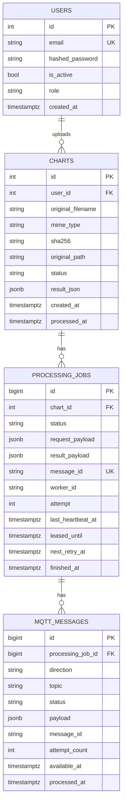

# Компактная схема БД

Текущая схема backend намеренно упрощена. В ней остались только основные бизнес-таблицы и единая таблица MQTT-сообщений.

## Таблицы

| Таблица | Назначение |
|---|---|
| `users` | Пользователи, роли, пароль, флаг активности |
| `charts` | Загруженные графики, файловые метаданные, статус обработки и `result_json` |
| `processing_jobs` | Задачи обработки, попытки, lease, heartbeat, результат worker |
| `mqtt_messages` | Исходящие и входящие MQTT-сообщения |

## Связи

- один `user` может иметь много `charts`
- один `chart` может иметь много `processing_jobs`
- один `processing_job` может иметь много `mqtt_messages`

## Особенности

- `mqtt_messages` используется только в MQTT-режиме
- при `App.MqttEnabled = false` backend и worker могут продолжать работать без активного использования `mqtt_messages`
- alert history и notification queue в БД больше не хранятся

## Что было убрано

Из активной EF Core-модели удалены:

- `outbox_messages`
- `inbox_messages`
- `processing_alert_states`
- `processing_alert_events`

Логика старых `outbox` и `inbox` объединена в `mqtt_messages`:

- `direction = out` — сообщения backend -> worker
- `direction = in` — сообщения worker -> backend

## ER-диаграмма

