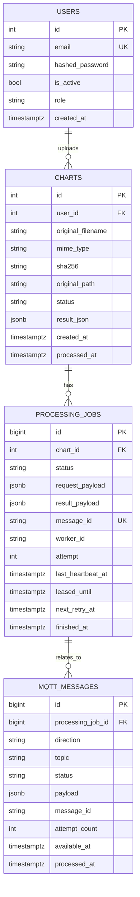

# Compact database schema

The active backend schema is intentionally compact. It keeps only business data and the minimal MQTT audit/retry table.

## Tables

| Table | Purpose |
|---|---|
| `users` | Users, roles, password hashes and activity flag. |
| `charts` | Uploaded charts, file metadata, processing status and `result_json`. |
| `processing_jobs` | ML processing jobs, status, lease, heartbeat, retry state and worker result payload. |
| `mqtt_messages` | Unified MQTT message table for both outbound backend requests and inbound ML events. |

## Removed tables

The previous separate tables `outbox_messages`, `inbox_messages`, `processing_alert_states` and `processing_alert_events` are no longer part of the active EF Core model.

`mqtt_messages.direction` replaces the old split:

- `out` means backend -> ML messages, formerly outbox.
- `in` means ML -> backend messages, formerly inbox.

Alert snapshots are now derived from `processing_jobs` and `mqtt_messages` at request time. Alert history and notification queue are not persisted in the compact schema.

## ER diagram

