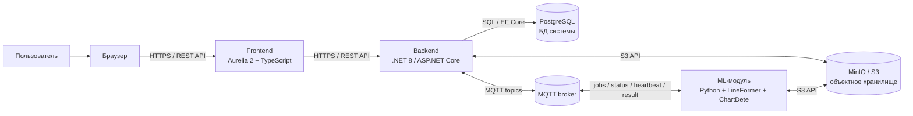
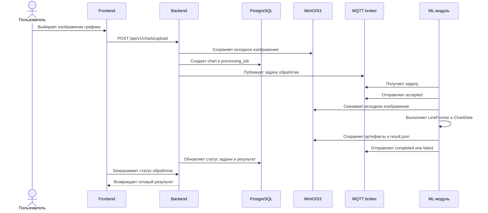
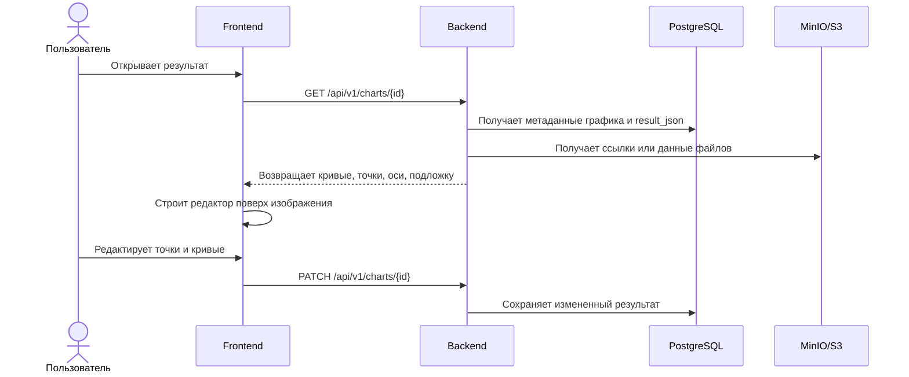
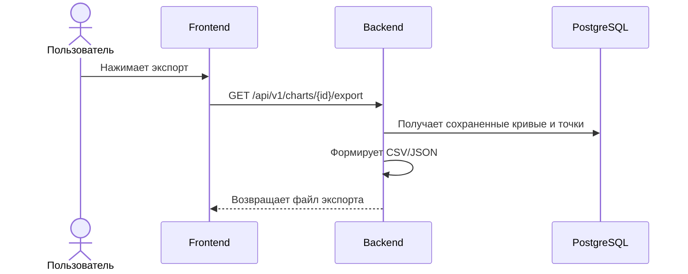
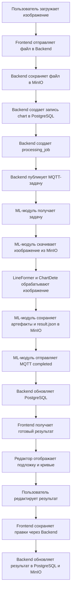

# Текущее состояние и план развития информационной системы

Дата актуализации: 21 апреля 2026 г.

Документ описывает, что уже реализовано в проекте, какой технологический стек используется сейчас, какие компоненты планируется доработать дальше и как должны протекать потоки данных в итоговой архитектуре.

## 1. Назначение системы

Информационная система предназначена для загрузки изображений с графиками функций, автоматической обработки этих изображений ML-модулем, получения распознанных кривых и последующего редактирования результата пользователем в графическом редакторе.

Основная идея системы:

- пользователь загружает изображение графика через веб-интерфейс;
- backend сохраняет исходные данные и создает задачу обработки;
- ML-модуль выполняет обработку изображения с использованием LineFormer и ChartDete;
- результат обработки возвращается в backend;
- frontend отображает изображение-подложку и распознанные кривые в редакторе;
- пользователь может скорректировать кривые, точки, цвета, названия и параметры отображения;
- итоговые данные можно сохранить и экспортировать.

## 2. Что уже готово

### 2.1. Backend

Backend был перенесен на стек .NET 8.

Реализовано:

- ASP.NET Core Web API;
- работа с PostgreSQL через Entity Framework Core;
- базовая доменная модель для пользователей, графиков и задач обработки;
- API для авторизации, загрузки изображений, получения списка результатов, открытия карточки графика, редактирования результата и экспорта данных;
- механизм постановки задач обработки;
- инфраструктура для обработки статусов задач;
- поддержка MQTT-связи с ML-воркером;
- механизмы надежности для обработки задач: lease, heartbeat, retry, inbox/outbox;
- обработка сообщений от ML-модуля о принятии задачи, прогрессе, успешном завершении или ошибке;
- частичная инфраструктура мониторинга и фиксации проблем обработки.

Текущий backend уже является центральным координатором системы: он принимает запросы от frontend, хранит состояние в БД, создает задачи для ML-модуля и предоставляет пользователю результат.

### 2.2. База данных

Используется PostgreSQL.

В БД хранятся:

- пользователи и данные авторизации;
- записи о загруженных графиках;
- метаданные файлов;
- статусы обработки;
- результаты распознавания;
- задачи обработки;
- служебные сообщения inbox/outbox для надежного обмена;
- информация для lease/heartbeat;
- данные для повторной обработки и диагностики ошибок.

БД не должна хранить большие бинарные файлы. Для изображений и артефактов обработки в целевой архитектуре планируется использовать S3-совместимое хранилище MinIO.

### 2.3. Frontend

Frontend был перенесен на TypeScript-стек с Aurelia 2.

Реализовано:

- приложение на Aurelia 2;
- сборка через Vite;
- страницы авторизации;
- страница загрузки изображения;
- страница списка результатов;
- страница просмотра и редактирования графика;
- нативный редактор графиков без зависимости от старого frontend-стека;
- отображение кривых, точек, названий и цветов;
- изменение размера точек;
- добавление, удаление и перемещение точек;
- изменение размеров окна редактора;
- работа с изображением-подложкой;
- подготовка к сопоставлению координат редактора с исходным изображением и результатами LineFormer.

Редактор находится в стадии стабилизации: основная функциональность перенесена, но отдельно требуется довести точность наложения кривых, точек и числовых делений осей на изображение-подложку.

### 2.4. ML-модуль

ML-модуль остается на Python.

Реализовано:

- сохранение существующей Python-части проекта;
- интеграция с LineFormer;
- интеграция с ChartDete;
- получение задания от backend;
- обработка изображения;
- формирование результата распознавания;
- отправка статусов и результата обратно в backend;
- поддержка работы через MQTT.

ML-модуль сейчас отвечает именно за вычислительную часть: детектирование кривых, анализ изображения и подготовку данных, которые затем используются редактором.

### 2.5. MQTT-связь

Для связи backend и ML-модуля добавлена MQTT-инфраструктура.

Реализуемая модель обмена:

- backend публикует задачу обработки;
- ML-модуль получает задачу;
- ML-модуль отправляет подтверждение принятия задачи;
- во время обработки ML-модуль отправляет heartbeat;
- после завершения ML-модуль отправляет сообщение об успехе или ошибке;
- backend обновляет состояние задачи и графика в БД.

MQTT используется не как замена БД или файлового хранилища, а как транспорт событий и команд между backend и ML-модулем.

### 2.6. Тестирование

Добавлены тесты для backend-логики.

Покрываемые направления:

- постановка задач обработки;
- изменение статусов processing jobs;
- lease/heartbeat;
- MQTT-сценарии;
- обработка входящих и исходящих сообщений;
- часть сценариев отказоустойчивости.

Также выполнялась проверка сборки frontend и backend.

## 3. Текущий стек технологий

| Компонент | Технологии |
|---|---|
| Frontend | Aurelia 2, TypeScript, Vite, HTML, CSS |
| Backend | .NET 8, ASP.NET Core Web API, Entity Framework Core |
| База данных | PostgreSQL |
| ML-модуль | Python 3.10, LineFormer, ChartDete |
| Обмен backend-ML | MQTT |
| Текущее файловое хранение | Локальное storage-хранилище проекта |
| Целевое файловое хранение | MinIO как S3-совместимое объектное хранилище |
| Тестирование backend | .NET test framework, интеграционные и модульные тесты |
| Сборка frontend | npm, Vite |

## 4. Целевая архитектура

В итоговой версии система должна быть разделена на независимые сервисы:

- frontend размещается на отдельном сервере;
- backend размещается на отдельном сервере;
- ML-модуль размещается на отдельном сервере;
- PostgreSQL находится на стороне backend;
- MinIO заменяет локальное storage-хранилище;
- backend и ML-модуль оба обращаются к MinIO;
- backend и ML-модуль обмениваются событиями через MQTT.

### 4.1. Общая схема компонентов



### 4.2. Почему MinIO заменяет storage

Сейчас проект использует локальное файловое хранилище. Это удобно для разработки, но неудобно для распределенной системы, где backend и ML-модуль находятся на разных серверах.

MinIO решает эту проблему:

- backend может загрузить исходное изображение в общее S3-хранилище;
- ML-модуль может скачать изображение из того же хранилища;
- ML-модуль может положить результаты обработки обратно в MinIO;
- backend может получить результат по object key;
- не требуется общий сетевой диск между серверами;
- проще масштабировать ML-воркеры;
- проще переносить систему в Docker, Kubernetes или на отдельные серверы.

## 5. Потоки данных в целевой системе

### 5.1. Загрузка изображения и запуск обработки



### 5.2. Открытие результата в редакторе



### 5.3. Экспорт данных



## 6. Основные API-потоки

### 6.1. Frontend -> Backend

Frontend общается с backend через HTTP API.

Основные группы методов:

| Назначение | Пример маршрута | Описание |
|---|---|---|
| Авторизация | `POST /api/v1/auth/login` | Вход пользователя |
| Проверка сессии | `GET /api/v1/auth/me` | Получение текущего пользователя |
| Загрузка изображения | `POST /api/v1/charts/upload` | Создание нового графика и задачи обработки |
| Список результатов | `GET /api/v1/charts` | Получение загруженных графиков |
| Карточка графика | `GET /api/v1/charts/{id}` | Получение данных графика, результата и статуса |
| Файлы графика | `GET /api/v1/charts/{id}/files/{kind}` | Получение исходного изображения или артефактов |
| Сохранение правок | `PATCH /api/v1/charts/{id}` | Сохранение изменений редактора |
| Предпросмотр сплайна | `POST /api/v1/charts/{id}/cubic-preview` | Построение кривой по выбранным точкам |
| Экспорт | `GET /api/v1/charts/{id}/export` | Экспорт результата |

### 6.2. Backend -> PostgreSQL

Backend обращается к БД через API доступа к данным, реализованный на Entity Framework Core.

В БД должны храниться:

- пользователи;
- роли и права;
- графики;
- статусы графиков;
- задачи обработки;
- lease/heartbeat;
- результат распознавания;
- object keys файлов в MinIO;
- служебные сообщения inbox/outbox;
- диагностическая информация.

### 6.3. Backend <-> ML через MQTT

MQTT используется для событийного обмена.

Планируемые topic-направления:

| Topic | Отправитель | Получатель | Назначение |
|---|---|---|---|
| `charts/process/request` | Backend | ML-модуль | Новая задача обработки |
| `charts/process/accepted` | ML-модуль | Backend | Задача принята в работу |
| `charts/process/heartbeat` | ML-модуль | Backend | ML-модуль продолжает обработку |
| `charts/process/completed` | ML-модуль | Backend | Обработка завершена успешно |
| `charts/process/failed` | ML-модуль | Backend | Обработка завершена ошибкой |

MQTT-сообщения должны содержать не сами файлы, а идентификаторы, object keys и служебные данные.

Пример payload для задачи:

```json
{
  "jobId": "uuid",
  "chartId": 123,
  "originalImageKey": "charts/123/original/input.png",
  "resultKey": "charts/123/results/result.json",
  "requestedAt": "2026-04-21T00:00:00Z"
}
```

Пример payload для завершения:

```json
{
  "jobId": "uuid",
  "chartId": 123,
  "status": "completed",
  "resultKey": "charts/123/results/result.json",
  "artifacts": {
    "lineformerImageKey": "charts/123/artifacts/lineformer/overlay.png",
    "chartdeteJsonKey": "charts/123/artifacts/chartdete/result.json"
  },
  "completedAt": "2026-04-21T00:02:30Z"
}
```

### 6.4. Backend и ML -> MinIO/S3

В целевой архитектуре backend и ML-модуль оба используют S3 API.

Планируемая структура объектов:

```text
charts/{chartId}/original/{fileName}
charts/{chartId}/artifacts/lineformer/{fileName}
charts/{chartId}/artifacts/chartdete/{fileName}
charts/{chartId}/results/result.json
charts/{chartId}/exports/{fileName}
```

Backend отвечает за:

- загрузку исходного изображения;
- выдачу frontend доступа к файлам;
- хранение object key в БД;
- сохранение пользовательских правок;
- экспорт результата.

ML-модуль отвечает за:

- скачивание исходного изображения;
- сохранение результатов LineFormer;
- сохранение результатов ChartDete;
- сохранение итогового result.json;
- передачу backend ссылок на созданные объекты через MQTT.

## 7. Что планируется реализовать дальше

### 7.1. Стабилизация редактора

Необходимо довести редактор до стабильного состояния.

План:

- добиться точного наложения кривых редактора на изображение-подложку;
- синхронизировать координаты точек с числовыми делениями осей;
- проверить масштабирование окна редактора без смещения точек;
- проверить работу drag-and-drop точек;
- проверить добавление и удаление точек;
- проверить изменение цвета, названия кривой и размера точек;
- закрепить формат данных, который frontend получает от backend для построения редактора.

### 7.2. Переход с локального storage на MinIO

План:

- добавить конфигурацию MinIO в backend;
- добавить S3-клиент в backend;
- вынести работу с файлами в отдельную абстракцию;
- реализовать MinIO-хранилище как замену локального storage;
- сохранить возможность локального storage только как dev/fallback-режим, если это потребуется;
- добавить S3-клиент в ML-модуль;
- изменить MQTT payload так, чтобы он передавал object keys вместо локальных путей;
- добавить миграцию БД для хранения object keys;
- проверить загрузку, обработку и выдачу файлов через MinIO.

### 7.3. Доведение MQTT-контракта

План:

- окончательно зафиксировать формат MQTT-сообщений;
- добавить версионирование payload;
- настроить QoS;
- проверить повторную доставку сообщений;
- обеспечить идемпотентную обработку сообщений;
- добавить обработку зависших задач;
- настроить правила retry;
- проверить сценарии перезапуска backend, MQTT broker и ML-модуля.

### 7.4. Разнесение сервисов по серверам

Планируемая схема размещения:

| Сервер | Что размещается |
|---|---|
| Frontend-сервер | Aurelia-приложение, статические файлы, reverse proxy |
| Backend-сервер | .NET 8 API, PostgreSQL, доступ к MinIO, MQTT-клиент |
| ML-сервер | Python ML-worker, LineFormer, ChartDete, MQTT-клиент, S3-клиент |
| Storage-сервер или отдельный сервис | MinIO |
| MQTT-сервер | MQTT broker |

PostgreSQL по плану остается на стороне backend. MinIO может быть расположен рядом с backend или выделен в отдельный сервис, но доступ к нему должны иметь и backend, и ML-модуль.

### 7.5. Безопасность и эксплуатация

План:

- настроить HTTPS между frontend и backend;
- настроить защищенное подключение к PostgreSQL;
- настроить доступ к MinIO по ключам доступа;
- не хранить секреты в репозитории;
- добавить `.env`/appsettings для разных окружений;
- настроить CORS только для разрешенных frontend-адресов;
- ограничить доступ к файлам через backend или signed URLs;
- добавить логирование критичных операций;
- добавить health checks для backend, ML-модуля, PostgreSQL, MQTT и MinIO.

### 7.6. Интеграционные тесты

План:

- проверить полный сценарий загрузки изображения;
- проверить создание задачи обработки;
- проверить доставку MQTT-сообщения;
- проверить работу ML-модуля;
- проверить запись результата в MinIO;
- проверить обновление статуса в БД;
- проверить открытие результата во frontend;
- проверить сохранение правок редактора;
- проверить экспорт результата.

## 8. Итоговый целевой поток данных



## 9. Краткий вывод

На текущем этапе проект уже перенесен на новый backend-стек .NET 8, frontend переведен на Aurelia 2 и TypeScript, ML-модуль сохранен на Python, а связь backend-ML переведена в сторону MQTT-модели. Основная архитектурная база уже заложена.

Ключевые оставшиеся задачи:

- стабилизировать редактор и точное наложение кривых на изображение;
- заменить локальное storage-хранилище на MinIO;
- окончательно закрепить MQTT-контракт между backend и ML;
- подготовить систему к работе на разных серверах;
- добавить интеграционные тесты полного цикла;
- настроить безопасность, конфигурацию окружений и эксплуатационный мониторинг.

Итоговая информационная система должна работать как распределенный набор сервисов: frontend обращается к backend, backend работает с PostgreSQL через API доступа к данным, backend и ML-модуль обмениваются задачами через MQTT, а файлы и артефакты обработки хранятся в общем S3-совместимом хранилище MinIO.
