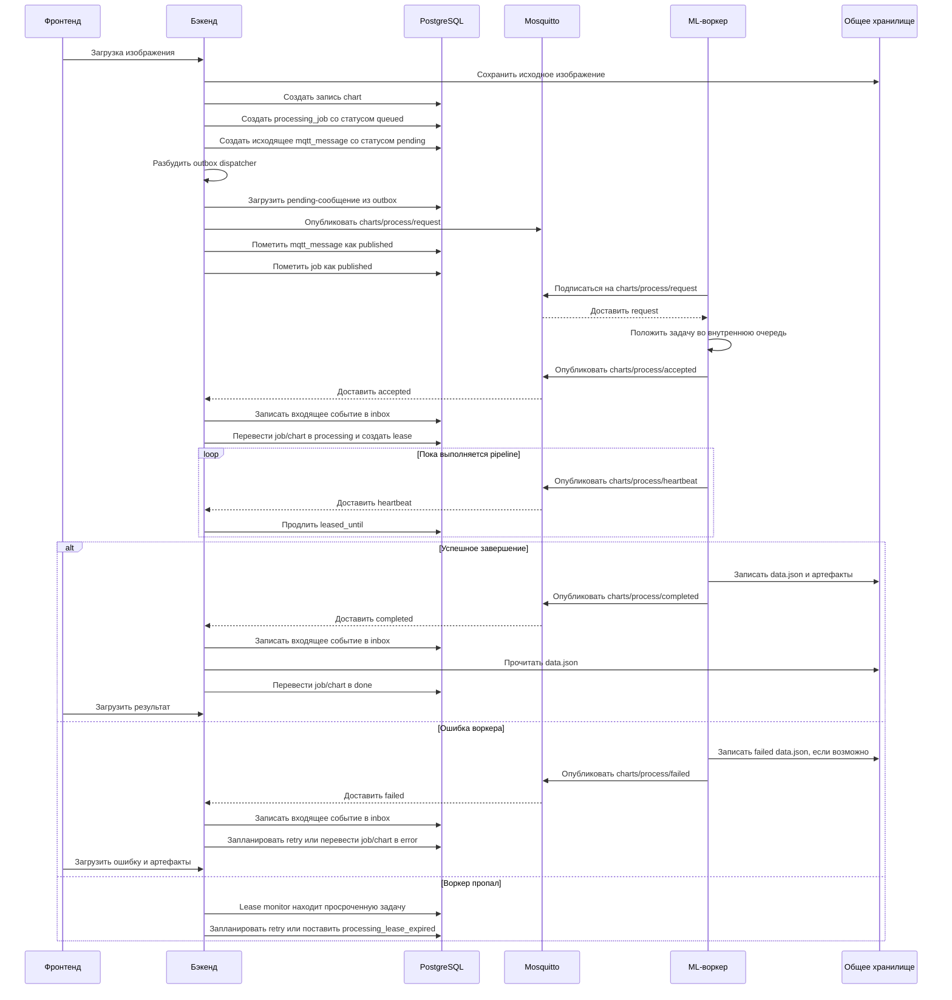

# Процесс работы MQTT в проекте

Этот документ описывает полный путь задачи обработки графика через MQTT: от загрузки изображения пользователем до получения результата или ошибки. Здесь описан текущий рабочий контур проекта, где backend, MQTT broker и ML worker запущены через Docker Compose.

## Общая идея

MQTT используется как транспорт между backend и ML worker.

Backend принимает файл от пользователя, сохраняет его в общее хранилище, создает запись задачи в базе данных и публикует MQTT-сообщение с просьбой обработать изображение. Worker подписан на этот топик, получает задачу, запускает ML pipeline, периодически отправляет heartbeat, а в конце отправляет событие `completed` или `failed`.

Важно: backend остается главным источником правды по состоянию задачи. Worker не должен напрямую менять статус задачи в базе в MQTT-режиме. Он только читает файл из общего storage, пишет туда результат и сообщает backend о ходе обработки через MQTT.

## Основные компоненты

### MQTT broker

В `docker-compose.yml` используется сервис:

```yaml
mqtt:
  image: eclipse-mosquitto:2
  ports:
    - "1883:1883"
```

Broker принимает сообщения от backend и worker. В текущей конфигурации это локальный Mosquitto внутри docker-сети проекта. Для backend broker доступен по имени `mqtt`, для worker тоже по имени `mqtt`.

### Backend

Backend отвечает за:

- прием загруженного изображения;
- сохранение исходного файла в storage;
- создание записи `charts`;
- создание записи `processing_jobs`;
- создание исходящего MQTT-сообщения в таблице `mqtt_messages`;
- публикацию сообщения в MQTT через outbox dispatcher;
- прием событий от worker;
- обновление статусов задачи и графика;
- дедупликацию входящих событий;
- retry при временных ошибках;
- фиксацию terminal error, если задача завершилась окончательной ошибкой.

Основные backend-файлы:

- `diplomWork/Services/ChartApiService.cs`
- `diplomWork/Services/MqttOutboxDispatcherService.cs`
- `diplomWork/Services/MqttPublisherService.cs`
- `diplomWork/Services/MqttProcessingConsumerService.cs`
- `diplomWork/Services/ProcessingJobStateService.cs`
- `diplomWork/Services/ProcessingLeaseMonitorService.cs`
- `diplomWork/Models/ProcessingJob.cs`
- `diplomWork/Models/MqttMessage.cs`

### ML worker

Worker отвечает за:

- подключение к MQTT broker;
- подписку на топик задач;
- получение JSON-задания от backend;
- постановку задания во внутреннюю очередь worker;
- запуск тяжелой ML-обработки в отдельном потоке;
- отправку событий `accepted`, `heartbeat`, `completed`, `failed`;
- запись результата `data.json` и артефактов в общий storage.

Основной файл worker:

- `ml-worker/extract-line-chart-data/worker_local.py`

### PostgreSQL

База хранит не только пользователей и графики, но и состояние processing-контура:

- `processing_jobs` - состояние обработки конкретного графика;
- `mqtt_messages` - outbox/inbox для MQTT-сообщений.

Это делает MQTT-контур устойчивее: если broker временно недоступен, backend не теряет задачу, потому что исходящее сообщение сначала сохраняется в БД.

## Конфигурация

### Backend MQTT-настройки

Настройки читаются через `AppOptions`.

Ключевые параметры:

| Параметр | Значение по умолчанию | Назначение |
|---|---:|---|
| `MQTT_ENABLED` / `App:MqttEnabled` | `false` | Включает MQTT-контур |
| `MQTT_HOST` / `App:MqttHost` | `localhost` | Host MQTT broker |
| `MQTT_PORT` / `App:MqttPort` | `1883` | Port MQTT broker |
| `MQTT_USERNAME` | пусто | Username, если broker требует авторизацию |
| `MQTT_PASSWORD` | пусто | Password, если broker требует авторизацию |
| `MQTT_CLIENT_ID_PREFIX` | `diplom-backend` | Префикс clientId backend-клиентов |
| `PROCESSING_LEASE_SECONDS` | `45` | На сколько секунд heartbeat продлевает lease |
| `PROCESSING_LEASE_MONITOR_INTERVAL_SECONDS` | `10` | Как часто backend проверяет истекшие lease |
| `PROCESSING_MAX_ATTEMPTS` | `3` | Общий лимит попыток для некоторых retry-сценариев |

В `docker-compose.yml` backend запускается с:

```yaml
MQTT_ENABLED: "true"
MQTT_HOST: mqtt
MQTT_PORT: "1883"
```

### Worker MQTT-настройки

Ключевые переменные worker:

| Параметр | Значение по умолчанию | Назначение |
|---|---:|---|
| `MQTT_ENABLED` | `true` | Включает MQTT-режим worker |
| `MQTT_BROKER` | `localhost` | Host MQTT broker |
| `MQTT_PORT` | `1883` | Port MQTT broker |
| `MQTT_STATUS_QOS` | `1` | QoS для статусных событий worker |
| `MQTT_PUBLISH_ACK_TIMEOUT_SECONDS` | `2` | Сколько ждать ACK для важных событий |
| `MQTT_PUBLISH_MAX_ATTEMPTS` | `5` | Сколько раз пробовать отправить важное событие |
| `MQTT_PUBLISH_RETRY_DELAY_SECONDS` | `2` | Пауза между попытками публикации |
| `PROCESSING_HEARTBEAT_INTERVAL_SECONDS` | `10` | Интервал heartbeat, минимум 5 секунд |

В `docker-compose.yml` worker запускается с:

```yaml
MQTT_ENABLED: "true"
MQTT_BROKER: mqtt
MQTT_PORT: "1883"
MQTT_STATUS_QOS: "1"
MQTT_PUBLISH_ACK_TIMEOUT_SECONDS: "10"
MQTT_PUBLISH_MAX_ATTEMPTS: "5"
MQTT_PUBLISH_RETRY_DELAY_SECONDS: "2"
```

## MQTT topics

В проекте используется пять топиков.

| Topic | Направление | Назначение |
|---|---|---|
| `charts/process/request` | backend -> worker | Backend просит обработать загруженный график |
| `charts/process/accepted` | worker -> backend | Worker принял задачу в обработку |
| `charts/process/heartbeat` | worker -> backend | Worker сообщает, что задача еще выполняется |
| `charts/process/completed` | worker -> backend | Worker успешно завершил обработку |
| `charts/process/failed` | worker -> backend | Worker завершил обработку ошибкой |

Названия топиков можно переопределить через переменные:

- `MQTT_PROCESS_REQUEST_TOPIC`
- `MQTT_PROCESS_ACCEPTED_TOPIC`
- `MQTT_PROCESS_HEARTBEAT_TOPIC`
- `MQTT_PROCESS_COMPLETED_TOPIC`
- `MQTT_PROCESS_FAILED_TOPIC`

## Таблица `processing_jobs`

`processing_jobs` хранит состояние одной обработки.

Ключевые поля:

| Поле | Смысл |
|---|---|
| `id` | Id задачи обработки |
| `chart_id` | Id графика из таблицы `charts` |
| `status` | Текущий статус задачи |
| `request_payload` | JSON, который backend отправляет worker |
| `result_payload` | JSON результата, если он сохранен в задаче |
| `error_message` | Текст ошибки |
| `error_code` | Машиночитаемый код ошибки |
| `message_id` | Id текущей MQTT-попытки обработки |
| `worker_id` | Id worker, который взял задачу |
| `attempt` | Номер фактически начатой попытки |
| `started_at` | Когда worker принял задачу |
| `last_heartbeat_at` | Когда пришел последний heartbeat |
| `leased_until` | До какого времени backend считает задачу живой |
| `next_retry_at` | Когда можно повторно отправлять задачу |
| `finished_at` | Когда задача завершилась |

Типичные статусы:

| Статус | Значение |
|---|---|
| `queued` | Задача создана и ждет публикации или повторной публикации |
| `published` | Задание опубликовано в MQTT |
| `processing` | Worker прислал `accepted`, задача выполняется |
| `done` | Worker прислал корректный `completed`, результат принят |
| `error` | Задача завершилась ошибкой |

## Таблица `mqtt_messages`

`mqtt_messages` используется как outbox и inbox.

Outbox - это исходящие сообщения backend к worker. Inbox - это входящие события worker к backend.

Ключевые поля:

| Поле | Смысл |
|---|---|
| `id` | Id MQTT-сообщения в БД |
| `processing_job_id` | Связанная processing-задача |
| `direction` | `out` для исходящих, `in` для входящих |
| `topic` | MQTT topic |
| `status` | Состояние сообщения |
| `payload` | JSON payload |
| `message_id` | Id сообщения для дедупликации |
| `attempt_count` | Сколько раз backend пытался опубликовать outbox-сообщение |
| `error_message` | Последняя ошибка публикации или обработки |
| `created_at` | Когда запись создана |
| `last_attempt_at` | Когда была последняя попытка публикации |
| `available_at` | Когда сообщение можно публиковать |
| `processed_at` | Когда сообщение опубликовано или обработано |

Для входящих сообщений есть уникальный индекс по паре:

```text
direction + message_id
```

Он нужен, потому что MQTT QoS 1 означает "at least once". То есть одно и то же событие может прийти больше одного раза. Backend должен уметь спокойно проигнорировать дубль.

## Создание задачи при загрузке файла

Процесс начинается в backend, когда пользователь загружает изображение.

`ChartApiService.UploadAndEnqueueAsync` делает следующее:

1. Принимает файл от frontend.
2. Проверяет размер файла.
3. Создает запись `charts`.
4. Сохраняет оригинальный файл в storage.
5. Заполняет `chart.OriginalPath`.
6. Переводит chart в статус `uploaded`.
7. Создает `processing_jobs`.
8. Создает outbox-сообщение в `mqtt_messages`.
9. Будит `MqttOutboxDispatcherService` через `MqttOutboxSignal`.

Payload задачи создается примерно в таком виде:

```json
{
  "schemaVersion": 1,
  "messageId": "generated-guid",
  "jobId": 123,
  "chartId": 456,
  "userId": 1,
  "originalPath": "/app/storage/...",
  "storageRoot": "/app/storage",
  "lineformerUsePreprocessing": true
}
```

`messageId` здесь очень важен. Он является идентификатором конкретной попытки обработки. Если задача будет переотправлена при retry, backend создаст новый `messageId`.

## Почему backend использует outbox

Backend не публикует MQTT-сообщение напрямую из HTTP-запроса загрузки. Вместо этого он сначала сохраняет сообщение в таблицу `mqtt_messages` со статусом `pending`.

Это нужно для надежности:

- если broker временно недоступен, задача не потеряется;
- если публикация упала, сообщение останется в БД со статусом `error`;
- dispatcher позже попробует отправить его снова;
- HTTP-запрос загрузки не зависит напрямую от мгновенной доступности broker.

## Публикация request-сообщения backend

`MqttOutboxDispatcherService` работает как background service.

Он постоянно делает цикл:

1. Берет из `mqtt_messages` до 10 сообщений, где:
   - `direction = out`;
   - `status = pending` или `status = error`;
   - `available_at` пустой или уже наступил.
2. Увеличивает `attempt_count`.
3. Запоминает `last_attempt_at`.
4. Десериализует `payload`.
5. Публикует JSON в MQTT через `MqttPublisherService`.
6. При успехе ставит сообщению:
   - `status = published`;
   - `processed_at = now`;
   - `available_at = null`;
   - `error_message = null`.
7. Если связанная `processing_jobs` все еще в статусе `queued`, переводит ее в `published`.
8. При ошибке публикации ставит:
   - `status = error`;
   - `error_message = текст ошибки`;
   - `available_at = now + delay`.

Delay при ошибке публикации считается так:

```text
min(30 секунд, max(5 секунд, attempt_count * 5 секунд))
```

Если сообщений нет, dispatcher не крутит CPU постоянно. Он ждет сигнал `MqttOutboxSignal` или таймаут 2 секунды.

## MQTT publisher backend

`MqttPublisherService` отвечает за реальное подключение к broker и публикацию.

Особенности:

- MQTT-клиент создается лениво;
- используется один клиент publisher;
- подключение защищено lock-ом, чтобы параллельные публикации не создавали несколько клиентов;
- clientId имеет вид `diplom-backend-publisher-{guid}`;
- используется MQTT protocol version 3.1.1;
- используется clean session;
- если заданы `MQTT_USERNAME` и `MQTT_PASSWORD`, они передаются broker;
- публикация идет с QoS `AtLeastOnce`.

QoS `AtLeastOnce` означает, что broker должен подтвердить доставку, но при сетевых повторах возможно повторное получение одного и того же сообщения. Поэтому на стороне backend для входящих событий есть inbox-дедупликация.

## Получение request-сообщения worker

Worker в MQTT-режиме запускает `main()` из `worker_local.py`.

Если `MQTT_ENABLED=true`, worker:

1. Создает MQTT-клиент.
2. Назначает callbacks `on_connect` и `on_message`.
3. Запускает отдельный daemon thread `_job_worker`.
4. Пытается подключиться к broker.
5. Если broker еще не готов, повторяет подключение каждую секунду.
6. После подключения вызывает `loop_forever()`.

Когда worker подключился, `on_connect` подписывает его на:

```text
charts/process/request
```

Когда приходит сообщение, `on_message`:

1. Парсит JSON.
2. Достает:
   - `chartId`;
   - `originalPath`;
   - `jobId`;
   - `messageId`;
   - `lineformerUsePreprocessing`.
3. Проверяет, что есть `chartId` и `originalPath`.
4. Кладет задачу в локальную очередь `_job_queue`.

Тяжелая ML-обработка не запускается прямо внутри MQTT callback. Это важная оптимизация. Callback должен быстро принять сообщение и освободить MQTT loop. Реальная обработка идет в отдельном worker thread.

## Внутренняя очередь worker

В worker есть очередь:

```python
_job_queue = queue.Queue()
```

Поток `_job_worker` постоянно ждет задачи из этой очереди. Когда задача появилась, он вызывает:

```python
process_job(...)
```

После завершения, даже если была ошибка, вызывается:

```python
_job_queue.task_done()
```

Это разделение делает MQTT-клиент более отзывчивым: он может продолжать поддерживать соединение и принимать сообщения, пока тяжелая обработка выполняется отдельно.

## Событие `accepted`

Как только worker начинает `process_job`, он сначала публикует событие:

```text
charts/process/accepted
```

Пример payload:

```json
{
  "schemaVersion": 1,
  "jobId": 123,
  "chartId": 456,
  "messageId": "accepted-originalMessageId-ab12cd34",
  "requestMessageId": "originalMessageId",
  "workerId": "local-worker-..."
}
```

Здесь есть два разных id:

- `messageId` - id самого события `accepted`;
- `requestMessageId` - id исходного request-сообщения backend.

Backend по `requestMessageId` понимает, к какой именно попытке обработки относится событие.

Когда backend получает `accepted`, `ProcessingJobStateService.ApplyAcceptedAsync`:

1. Проверяет inbox-дедупликацию по `messageId`.
2. Находит `processing_jobs`.
3. Проверяет, что `requestMessageId` совпадает с текущим `processing_jobs.message_id`.
4. Игнорирует событие, если задача уже terminal (`done` или `error`).
5. Переводит job в `processing`.
6. Очищает старые ошибки.
7. Сохраняет `worker_id`.
8. Увеличивает `attempt`.
9. Заполняет `started_at`.
10. Ставит `last_heartbeat_at = now`.
11. Ставит `leased_until = now + ProcessingLeaseSeconds`.
12. Переводит chart в статус `processing`.

## Heartbeat и lease

После `accepted` worker запускает отдельный heartbeat thread.

Heartbeat отправляется в:

```text
charts/process/heartbeat
```

Payload похож на:

```json
{
  "schemaVersion": 1,
  "jobId": 123,
  "chartId": 456,
  "messageId": "heartbeat-originalMessageId-ab12cd34",
  "requestMessageId": "originalMessageId",
  "workerId": "local-worker-..."
}
```

Worker отправляет heartbeat каждые `PROCESSING_HEARTBEAT_INTERVAL_SECONDS`, но минимум каждые 5 секунд.

Backend при heartbeat:

1. Находит задачу.
2. Проверяет, что событие относится к текущей попытке.
3. Проверяет, что job сейчас в статусе `processing`.
4. Обновляет:
   - `worker_id`;
   - `last_heartbeat_at`;
   - `leased_until = now + ProcessingLeaseSeconds`.

Heartbeat не проходит через полноценную inbox-дедупликацию. Это нормально, потому что heartbeat не является финальным бизнес-событием. Его задача - только продлить lease. Повторный heartbeat не ломает состояние, он просто снова обновит время.

## Зачем нужен lease

Lease нужен, чтобы backend мог понять, что worker пропал.

Например:

- worker был остановлен;
- контейнер упал;
- процесс завис;
- broker-соединение оборвалось;
- задача зависла внутри ML pipeline и heartbeat перестал приходить.

Пока heartbeat приходит, `leased_until` постоянно отодвигается вперед. Если heartbeat перестал приходить, время `leased_until` истечет.

`ProcessingLeaseMonitorService` каждые `ProcessingLeaseMonitorIntervalSeconds` вызывает:

```text
ExpireTimedOutJobsAsync
```

Он ищет задачи:

```text
status = processing
leased_until < now
```

Если попытки еще разрешены, backend планирует retry. Если попытки закончились, backend переводит задачу в terminal error с кодом:

```text
processing_lease_expired
```

## Успешное завершение `completed`

Если ML pipeline завершился успешно, worker:

1. Формирует итоговый JSON результата.
2. Проверяет, что в JSON нет невалидных чисел вроде `NaN` или `Infinity`.
3. Пишет результат в `data.json` в общий storage.
4. Публикует событие:

```text
charts/process/completed
```

Пример payload:

```json
{
  "schemaVersion": 1,
  "jobId": 123,
  "chartId": 456,
  "messageId": "completed-originalMessageId-ab12cd34",
  "requestMessageId": "originalMessageId",
  "workerId": "local-worker-...",
  "resultJsonPath": "charts/456/data.json",
  "nPanels": 1,
  "nSeries": 2,
  "completedAt": "2026-04-29T12:00:00"
}
```

Worker отправляет `completed` с ожиданием ACK, потому что это финальное событие. Если ACK не получен, worker повторяет публикацию до `MQTT_PUBLISH_MAX_ATTEMPTS`.

Backend при `completed`:

1. Проверяет inbox-дедупликацию.
2. Находит задачу.
3. Проверяет, что событие относится к текущей попытке.
4. Игнорирует событие, если задача уже в terminal error, кроме особого случая с lease-expired.
5. Загружает result JSON:
   - либо из `payload.resultJson`;
   - либо из файла по `payload.resultJsonPath`.
6. Если результата нет или JSON невалидный, переводит задачу в terminal error `pipeline_output_invalid`.
7. Считает количество panels и series.
8. Переводит job в `done`.
9. Переводит chart в `done`.
10. Сохраняет `chart.ResultJson`.
11. Сохраняет `chart.NPanels` и `chart.NSeries`.
12. Очищает lease и retry-поля.

## Завершение с ошибкой `failed`

Если во время ML pipeline произошла ошибка, worker публикует:

```text
charts/process/failed
```

Пример payload:

```json
{
  "schemaVersion": 1,
  "jobId": 123,
  "chartId": 456,
  "messageId": "failed-originalMessageId-ab12cd34",
  "requestMessageId": "originalMessageId",
  "workerId": "local-worker-...",
  "errorMessage": "Non-finite numeric value at $.panels[0].series[0].points[0][0]: nan",
  "errorCode": "pipeline_output_invalid",
  "retryable": false,
  "resultJsonPath": "charts/456/data.json",
  "failedAt": "2026-04-29T12:00:00"
}
```

Worker также старается записать failed-result JSON в `data.json`. Это нужно, чтобы frontend мог показать доступные артефакты даже при ошибке построения данных.

Backend при `failed`:

1. Проверяет inbox-дедупликацию.
2. Находит задачу.
3. Проверяет, что событие относится к текущей попытке.
4. Игнорирует `failed`, если задача уже `done`.
5. Пытается загрузить result JSON из `resultJson` или `resultJsonPath`.
6. Определяет retry policy по `errorCode` и `retryable`.
7. Если ошибка retryable и лимит попыток не исчерпан, планирует retry.
8. Если retry не нужен или попытки закончились, переводит job в `error`.
9. Переводит chart в `error`.
10. Сохраняет `errorMessage`, `errorCode`, `processedAt`.
11. Если result JSON есть, сохраняет его в chart, чтобы артефакты остались доступны.

## Обработка `NaN` и невалидных чисел

JSON стандартно не поддерживает `NaN` и `Infinity` как числовые значения. Если worker сформирует такой результат и отправит его как обычный JSON, backend не сможет распарсить payload или сохранить результат в PostgreSQL `jsonb`.

Поэтому worker проверяет результат перед `completed`. Если находит не-finite число, например:

```text
Non-finite numeric value at $.panels[0].series[0].points[0][0]: nan
```

он не должен отправлять `completed`. Вместо этого он отправляет `failed` с:

```text
errorCode = pipeline_output_invalid
retryable = false
```

При этом worker по возможности сохраняет артефакты в failed-result JSON. Backend принимает такой `failed`, завершает процесс ошибкой и сохраняет доступные артефакты для frontend.

## Retry-логика

Retry принимает backend, а не worker.

Worker сообщает:

- `errorCode`;
- `retryable`;
- `errorMessage`.

Backend нормализует `errorCode` и выбирает policy.

Основные коды:

| Код | Retryable | Смысл |
|---|---:|---|
| `input_file_missing` | `false` | Исходный файл не найден |
| `storage_permission_denied` | `false` | Нет доступа к storage |
| `pipeline_output_invalid` | `false` | Pipeline выдал невалидный результат |
| `modal_backend_unavailable` | `true` | Внешний backend временно недоступен |
| `network_timeout` | `true` | Сетевая временная ошибка |
| `unexpected_worker_error` | зависит от fallback | Неизвестная ошибка worker |
| `processing_lease_expired` | `true` | Backend не получил heartbeat вовремя |

Если retry нужен, `ProcessingJobStateService.ScheduleRetry`:

1. Создает новый `messageId`.
2. Переводит job обратно в `queued`.
3. Ставит `next_retry_at`.
4. Очищает worker/heartbeat/lease/finished/result.
5. Обновляет `request_payload`.
6. Создает новое outbox-сообщение в `mqtt_messages`.
7. Оставляет chart в `processing`.

Новое outbox-сообщение будет опубликовано dispatcher-ом после наступления `available_at`.

## Защита от старых событий

В MQTT возможны запоздавшие события. Например:

1. Worker A получил задачу.
2. Backend решил, что lease истек, и создал retry с новым `messageId`.
3. Worker B начал новую попытку.
4. Worker A внезапно прислал старый `completed`.

Чтобы такое событие не перезаписало актуальный результат, backend сравнивает:

```text
payload.requestMessageId == processing_jobs.message_id
```

Если они не совпадают, событие считается устаревшим и игнорируется.

Это одна из ключевых частей надежности текущей схемы.

## Дедупликация входящих событий

Для событий `accepted`, `completed` и `failed` backend использует inbox через `mqtt_messages`.

Когда событие приходит:

1. Backend проверяет, есть ли уже `mqtt_messages` с:
   - `direction = in`;
   - таким же `message_id`.
2. Если есть, событие игнорируется.
3. Если нет, backend добавляет inbox-запись.
4. Затем применяет изменение состояния задачи.
5. Для relational database это делается внутри транзакции.

Это нужно из-за QoS 1. MQTT может доставить сообщение повторно, и это не должно приводить к повторному применению результата или ошибки.

## Почему heartbeat обрабатывается проще

Heartbeat не идет через inbox-дедупликацию.

Причина: heartbeat не завершает задачу и не меняет бизнес-результат. Он только обновляет `last_heartbeat_at` и `leased_until`.

Если один heartbeat придет два раза, вреда нет. Максимум backend дважды продлит lease примерно на одно и то же время.

## Result JSON и storage

Worker и backend используют общий volume storage:

```yaml
backend:
  volumes:
    - backend_storage:/app/storage

ml-worker:
  volumes:
    - backend_storage:/app/storage
```

Это значит:

- backend сохраняет исходное изображение в `/app/storage`;
- worker читает исходное изображение по `originalPath`;
- worker пишет результат и артефакты в тот же storage;
- backend читает `data.json` по `resultJsonPath`.

В MQTT payload обычно не передается большой результат целиком. Вместо этого worker передает путь:

```json
{
  "resultJsonPath": "..."
}
```

Так MQTT остается легким транспортом событий, а не каналом передачи больших данных.

## Отключенный MQTT-режим

Если `MQTT_ENABLED=false`, контур работает иначе.

Backend не создает outbox-сообщение для MQTT. Worker в `worker_local.py` при `MQTT_ENABLED=false` переходит в DB polling mode:

```python
if not MQTT_ENABLED:
    return _run_db_poll_loop()
```

В этом режиме worker сам опрашивает базу, берет queued-задачи и обновляет статусы напрямую. Этот режим нужен как fallback, но в текущем Docker Compose основной путь - MQTT.

## Что происходит при недоступном broker

Если backend не может опубликовать request:

1. Outbox-сообщение получает `status = error`.
2. В `error_message` записывается причина.
3. `available_at` переносится в будущее.
4. Dispatcher позже повторит публикацию.

Если worker стартует раньше broker, он не падает окончательно. Он печатает сообщение о недоступности broker и пробует подключиться снова каждую секунду.

## Что происходит при падении worker

Если worker упал после получения задачи:

1. Backend уже перевел job в `processing` после `accepted`.
2. Heartbeat перестает приходить.
3. `leased_until` истекает.
4. `ProcessingLeaseMonitorService` находит просроченную задачу.
5. Если попытки еще есть, backend создает retry с новым `messageId`.
6. Если попытки закончились, backend ставит terminal error `processing_lease_expired`.

## Что происходит при потере финального события

`completed` и `failed` worker публикует с ожиданием ACK и retry.

Если ACK не пришел:

1. Worker пробует повторить публикацию.
2. При QoS 1 broker может доставить событие больше одного раза.
3. Backend применит событие только один раз благодаря inbox-дедупликации.

Если финальное событие все равно не дошло, backend в итоге увидит отсутствие heartbeat и обработает задачу через lease timeout.

## Роль frontend

Frontend не работает с MQTT напрямую.

Для frontend процесс выглядит так:

1. Пользователь загружает изображение через HTTP API backend.
2. Backend возвращает chart/task данные.
3. Frontend периодически или по текущей логике проекта получает состояние графика через backend API.
4. Когда chart становится `done`, frontend открывает редактор с результатом.
5. Если chart становится `error`, frontend показывает ошибку.
6. Если при ошибке есть сохраненные артефакты в `ResultJson`, frontend может показать их в карусели.

MQTT полностью скрыт за backend.

## Текущий контракт сообщений

### Request

Topic:

```text
charts/process/request
```

Основные поля:

| Поле | Обязательность | Смысл |
|---|---:|---|
| `schemaVersion` | да | Версия схемы payload |
| `messageId` | да | Id текущей попытки |
| `jobId` | желательно | Id processing job |
| `chartId` | да | Id chart |
| `userId` | да | Id пользователя |
| `originalPath` | да | Путь к исходному изображению |
| `storageRoot` | да | Корень общего storage |
| `lineformerUsePreprocessing` | нет | Включать ли preprocessing LineFormer |

### Accepted

Topic:

```text
charts/process/accepted
```

Основные поля:

| Поле | Смысл |
|---|---|
| `schemaVersion` | Версия схемы |
| `messageId` | Id события accepted |
| `requestMessageId` | Id request-попытки |
| `jobId` | Id processing job |
| `chartId` | Id chart |
| `workerId` | Id worker |

### Heartbeat

Topic:

```text
charts/process/heartbeat
```

Основные поля:

| Поле | Смысл |
|---|---|
| `schemaVersion` | Версия схемы |
| `messageId` | Id события heartbeat |
| `requestMessageId` | Id request-попытки |
| `jobId` | Id processing job |
| `chartId` | Id chart |
| `workerId` | Id worker |

### Completed

Topic:

```text
charts/process/completed
```

Основные поля:

| Поле | Смысл |
|---|---|
| `schemaVersion` | Версия схемы |
| `messageId` | Id события completed |
| `requestMessageId` | Id request-попытки |
| `jobId` | Id processing job |
| `chartId` | Id chart |
| `workerId` | Id worker |
| `resultJson` | Inline JSON результата, если передается напрямую |
| `resultJsonPath` | Путь к `data.json` в storage |
| `nPanels` | Количество панелей |
| `nSeries` | Количество рядов |
| `completedAt` | Время завершения на стороне worker |

### Failed

Topic:

```text
charts/process/failed
```

Основные поля:

| Поле | Смысл |
|---|---|
| `schemaVersion` | Версия схемы |
| `messageId` | Id события failed |
| `requestMessageId` | Id request-попытки |
| `jobId` | Id processing job |
| `chartId` | Id chart |
| `workerId` | Id worker |
| `errorMessage` | Текст ошибки |
| `errorCode` | Код ошибки |
| `retryable` | Можно ли повторять, если backend policy это разрешает |
| `resultJson` | Inline failed-result JSON |
| `resultJsonPath` | Путь к failed-result `data.json` |
| `failedAt` | Время ошибки на стороне worker |

## Практический путь одной задачи

Ниже полный сценарий успешной обработки.

1. Пользователь нажимает загрузку изображения.
2. Frontend отправляет файл в backend.
3. Backend сохраняет файл в `backend_storage`.
4. Backend создает `charts`.
5. Backend создает `processing_jobs` со статусом `queued`.
6. Backend создает `mqtt_messages` со статусом `pending`, `direction = out`.
7. Backend будит outbox dispatcher.
8. Dispatcher публикует request в `charts/process/request`.
9. Dispatcher помечает outbox-сообщение как `published`.
10. Dispatcher переводит job из `queued` в `published`.
11. Worker получает request.
12. Worker кладет задачу во внутреннюю очередь.
13. Worker thread берет задачу.
14. Worker публикует `accepted`.
15. Backend получает `accepted`.
16. Backend пишет inbox-запись.
17. Backend переводит job и chart в `processing`.
18. Worker запускает heartbeat thread.
19. Worker запускает ML pipeline.
20. Worker периодически публикует `heartbeat`.
21. Backend продлевает `leased_until`.
22. Worker сохраняет результат в storage.
23. Worker публикует `completed`.
24. Backend получает `completed`.
25. Backend пишет inbox-запись.
26. Backend читает `data.json`.
27. Backend переводит job и chart в `done`.
28. Frontend получает готовый результат через backend API и открывает редактор.

## Практический путь задачи с ошибкой

Ниже сценарий ошибки на примере невалидного результата с `NaN`.

1. Worker получил задачу и отправил `accepted`.
2. Backend перевел задачу в `processing`.
3. Worker выполняет ML pipeline.
4. Pipeline сформировал точки, где есть `NaN`.
5. Worker проверяет JSON и видит не-finite число.
6. Worker формирует failed-result JSON с доступными артефактами.
7. Worker сохраняет `data.json`.
8. Worker отправляет `failed` с `errorCode = pipeline_output_invalid`.
9. Backend получает `failed`.
10. Backend проверяет, что это текущая попытка.
11. Backend определяет, что ошибка non-retryable.
12. Backend переводит job в `error`.
13. Backend переводит chart в `error`.
14. Backend сохраняет `ResultJson`, если он был доступен.
15. Frontend показывает ошибку и может показать артефакты.

## Важные свойства схемы

### Backend является источником правды

Даже если worker что-то обработал, итоговое состояние появляется только после того, как backend принял событие и обновил БД.

### Request не теряется при временной проблеме MQTT

Request сначала сохраняется в outbox-таблицу, а уже потом публикуется.

### Финальные события защищены от дублей

`completed` и `failed` могут прийти повторно, но backend применит их один раз.

### Старые события не должны портить новую попытку

`requestMessageId` защищает от ситуации, когда старый worker поздно прислал результат после retry.

### Heartbeat отделяет долгую обработку от зависания

Долгая обработка нормальна, если heartbeat продолжает приходить. Если heartbeat пропал, backend считает задачу зависшей и запускает retry или terminal error.

## Диаграмма


