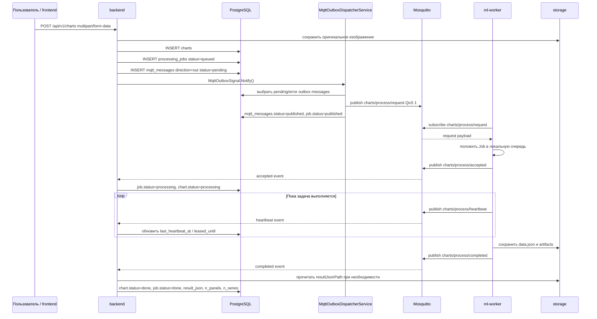
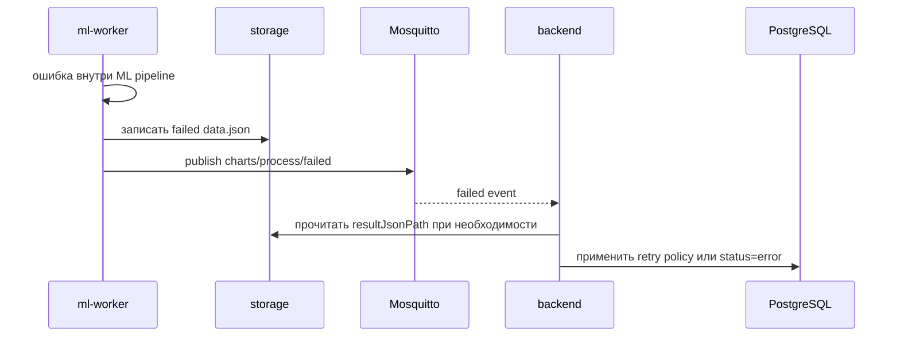
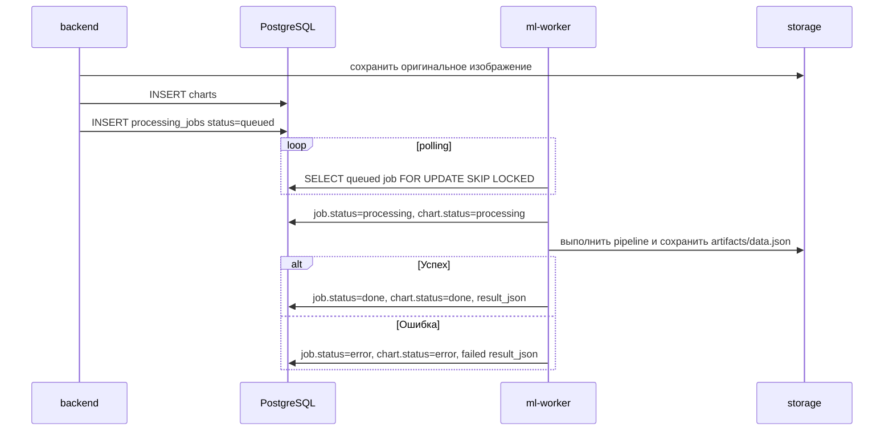
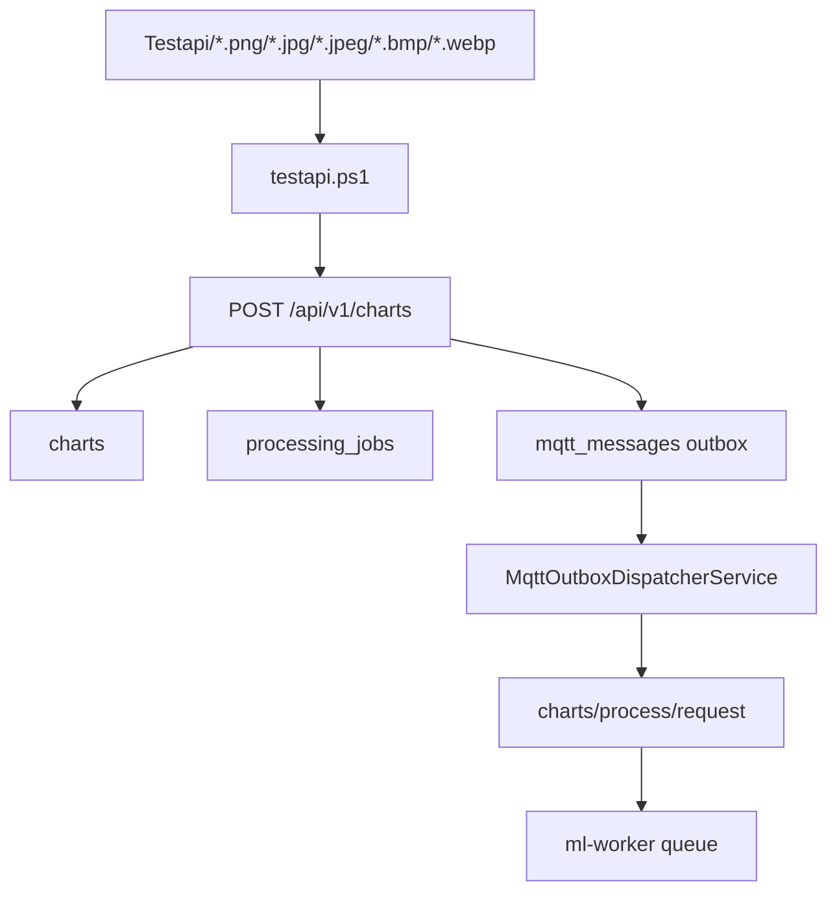
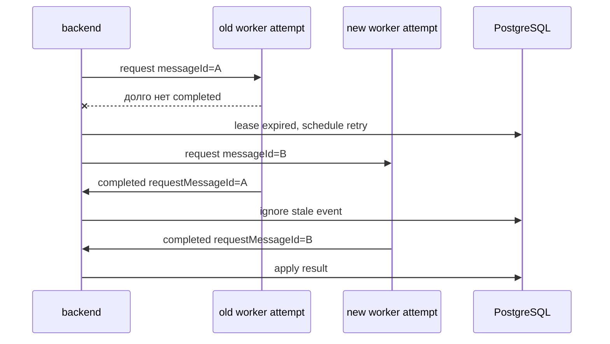
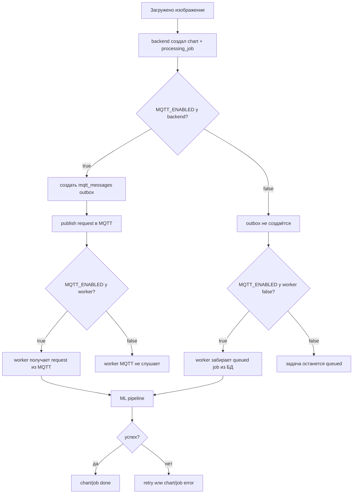

# Схема работы пайплайна обработки графиков

Документ описывает полный путь изображения от загрузки в API до готового результата в `result_json`. Основной режим работы проекта — через MQTT. Также сохранён fallback-режим через прямой polling базы данных worker'ом.

## Основные участники

| Компонент | Роль |
|---|---|
| `frontend` | Загружает изображение через HTTP API и показывает статус/результат |
| `backend` | Принимает файл, создаёт `chart`, создаёт `processing_job`, ставит задачу в очередь |
| `PostgreSQL` | Хранит пользователей, графики, задачи обработки и MQTT outbox/inbox |
| `mqtt` / Mosquitto | Передаёт задачи от backend к worker и события от worker к backend |
| `ml-worker` | Получает задачу, запускает ML pipeline, сохраняет результат и отправляет статус |
| `storage` volume | Общее файловое хранилище backend и worker |

## Основные таблицы

| Таблица | Назначение |
|---|---|
| `charts` | Основная запись загруженного графика, статус обработки, путь к файлу, `result_json` |
| `processing_jobs` | Задачи обработки, попытки, lease, heartbeat, payload запроса/результата |
| `mqtt_messages` | Outbox для исходящих сообщений backend и inbox для дедупликации входящих событий worker |

## Основные статусы

### `charts.status`

| Статус | Значение |
|---|---|
| `processing` | График создан или находится в обработке |
| `uploaded` | Файл сохранён, задача создана |
| `done` | Обработка успешно завершена |
| `error` | Обработка завершилась ошибкой |

### `processing_jobs.status`

| Статус | Значение |
|---|---|
| `queued` | Задача создана и ожидает отправки/обработки |
| `published` | Задача опубликована в MQTT |
| `processing` | Worker принял задачу в работу |
| `done` | Worker успешно завершил задачу |
| `error` | Worker или backend зафиксировал ошибку |

## MQTT-топики

| Топик | Направление | Назначение |
|---|---|---|
| `charts/process/request` | backend -> worker | Запрос на обработку графика |
| `charts/process/accepted` | worker -> backend | Worker принял задачу |
| `charts/process/heartbeat` | worker -> backend | Worker сообщает, что задача ещё выполняется |
| `charts/process/completed` | worker -> backend | Задача успешно завершена |
| `charts/process/failed` | worker -> backend | Задача завершилась ошибкой |

Названия топиков настраиваются через переменные окружения backend и worker.

## Вариант 1. Основной pipeline через MQTT

Используется, когда `MQTT_ENABLED=true` у backend и worker.



### Ключевые детали

- Backend не публикует MQTT напрямую из контроллера.
- Сначала создаётся outbox-сообщение в `mqtt_messages`.
- `MqttOutboxSignal` будит dispatcher сразу после добавления сообщения.
- `MqttPublisherService` держит долгоживущее MQTT-соединение.
- Worker не обрабатывает задачу прямо внутри MQTT callback, а кладёт её в локальную очередь.
- Результат сохраняется в общий `storage`, а в MQTT чаще передаётся путь `resultJsonPath`, а не весь большой JSON.

## Вариант 2. Успешная обработка через MQTT

### 1. Backend создаёт request payload

Примерная структура сообщения в `charts/process/request`:

```json
{
  "schemaVersion": 1,
  "messageId": "request-message-id",
  "jobId": 123,
  "chartId": 45,
  "userId": 7,
  "originalPath": "users/7/charts/45/image.png",
  "storageRoot": "/app/storage",
  "lineformerUsePreprocessing": true
}
```

### 2. Worker отправляет `accepted`

```json
{
  "schemaVersion": 1,
  "jobId": 123,
  "chartId": 45,
  "messageId": "accepted-request-message-id-random",
  "requestMessageId": "request-message-id",
  "workerId": "local-worker-..."
}
```

Backend проверяет `requestMessageId`, чтобы не применить событие от старой попытки.

### 3. Worker отправляет `heartbeat`

Heartbeat нужен, чтобы backend понимал, что задача не зависла.

```json
{
  "schemaVersion": 1,
  "jobId": 123,
  "chartId": 45,
  "messageId": "heartbeat-request-message-id-random",
  "requestMessageId": "request-message-id",
  "workerId": "local-worker-..."
}
```

### 4. Worker сохраняет результат

Worker создаёт:

- `data.json`
- `lineformer/prediction.png`, если доступно
- `converted_datapoints/plot.png`, если доступно
- `chartdete/predictions.*`, если доступно

И формирует `result_json` примерно такого вида:

```json
{
  "panels": [
    {
      "id": "panel_0",
      "x_unit": "X",
      "y_unit": "Y",
      "series": [
        {
          "id": "series_0",
          "name": "series_0",
          "points": [[0, 1], [1, 2]]
        }
      ]
    }
  ],
  "artifacts": {
    "lineformer_prediction": "users/7/charts/45/lineformer/prediction.png",
    "converted_plot": "users/7/charts/45/converted_datapoints/plot.png",
    "restored_plot": "users/7/charts/45/converted_datapoints/plot.png"
  }
}
```

Перед записью worker проверяет, что в JSON нет `NaN` или `Infinity`.

### 5. Worker отправляет `completed`

```json
{
  "schemaVersion": 1,
  "jobId": 123,
  "chartId": 45,
  "messageId": "completed-request-message-id-random",
  "requestMessageId": "request-message-id",
  "workerId": "local-worker-...",
  "resultJsonPath": "users/7/charts/45/data.json",
  "nPanels": 1,
  "nSeries": 1,
  "completedAt": "2026-04-29T09:00:00"
}
```

Backend после этого:

- находит `processing_job`
- проверяет актуальность попытки через `requestMessageId`
- читает `data.json` из storage
- обновляет `processing_jobs.result_payload`
- обновляет `charts.result_json`
- выставляет `charts.status=done`
- выставляет `processing_jobs.status=done`

## Вариант 3. Ошибка обработки через MQTT

Если worker падает во время обработки, он формирует failed result и отправляет событие в `charts/process/failed`.



Пример failed payload:

```json
{
  "schemaVersion": 1,
  "jobId": 123,
  "chartId": 45,
  "messageId": "failed-request-message-id-random",
  "requestMessageId": "request-message-id",
  "workerId": "local-worker-...",
  "errorMessage": "Pipeline did not create data.json",
  "errorCode": "unexpected_worker_error",
  "retryable": false,
  "resultJsonPath": "users/7/charts/45/data.json",
  "failedAt": "2026-04-29T09:00:00"
}
```

Failed `result_json` может содержать artifacts, если они успели появиться до ошибки:

```json
{
  "artifacts": {
    "lineformer_prediction": "users/7/charts/45/lineformer/prediction.png"
  },
  "ml_meta": {
    "worker_error": {
      "message": "Non-finite numeric value at $.panels[0].series[0].points[3][1]: nan",
      "code": "pipeline_output_invalid"
    }
  }
}
```

Backend после failed event:

- проверяет inbox-дедупликацию по `messageId`
- проверяет актуальность попытки через `requestMessageId`
- определяет retry policy
- либо планирует retry, либо завершает задачу ошибкой
- обновляет `charts.status=error`, если ошибка терминальная
- сохраняет `result_json`, если он есть

## Вариант 4. Fallback без MQTT через DB polling

Используется, когда `MQTT_ENABLED=false` у worker. В этом режиме worker не слушает MQTT, а сам опрашивает таблицу `processing_jobs`.



### Отличия DB polling от MQTT-режима

| Поведение | MQTT-режим | DB polling режим |
|---|---|---|
| Доставка задачи | Через `mqtt_messages` outbox и MQTT broker | Worker сам читает `processing_jobs` |
| Accepted event | Через MQTT | Нет отдельного MQTT event |
| Heartbeat | Через MQTT heartbeat topic | Отдельного heartbeat-события нет, worker сам пишет промежуточные/финальные статусы в БД |
| Completed/failed | Через MQTT event + backend применяет состояние | Worker сам пишет финальный статус в БД |
| Inbox deduplication | Да, через `mqtt_messages direction=in` | Не используется |
| Зависимость от broker | Нужен Mosquitto | Не нужен |

## Вариант 5. Массовая загрузка изображений

Если запустить скрипт, который по очереди вызывает `POST /api/v1/charts` для всех файлов в папке `Testapi`, каждое изображение проходит обычный pipeline.



Важно: массовая загрузка не кладёт файлы напрямую в MQTT. Она создаёт много обычных HTTP upload-запросов, а backend уже сам создаёт задачи и outbox-сообщения.

## Вариант 6. Повторная попытка и устаревшие события

У каждой задачи есть `messageId`. Worker возвращает его как `requestMessageId`.

Это нужно для защиты от ситуации:

1. первая попытка зависла;
2. backend назначил retry с новым `messageId`;
3. старая попытка внезапно прислала `completed`;
4. backend должен проигнорировать старое событие.



## Outbox/inbox надёжность

### Outbox

Backend создаёт исходящее сообщение в `mqtt_messages`:

| Поле | Значение |
|---|---|
| `direction` | `out` |
| `topic` | `charts/process/request` |
| `status` | `pending`, `published` или `error` |
| `message_id` | request `messageId` |
| `processing_job_id` | связанная задача |
| `available_at` | когда можно публиковать или повторять попытку |

`MqttOutboxDispatcherService` выбирает до 10 сообщений за цикл и публикует их в MQTT.

Если публикация успешна:

- `mqtt_messages.status=published`
- `processing_jobs.status=published`, если job ещё был `queued`

Если публикация упала:

- `mqtt_messages.status=error`
- заполняется `error_message`
- выставляется `available_at` для повторной попытки

### Inbox

Входящие события от worker сохраняются в `mqtt_messages` как:

| Поле | Значение |
|---|---|
| `direction` | `in` |
| `topic` | `accepted`, `heartbeat`, `completed` или `failed` topic |
| `status` | `processed` |
| `message_id` | event `messageId` |
| `payload` | исходный event payload |

Если событие с таким `messageId` уже есть, backend его не применяет второй раз.

## Файловая схема результата

Примерная структура после обработки:

```text
storage/
└── users/
    └── 7/
        └── charts/
            └── 45/
                ├── original.png
                ├── data.json
                ├── lineformer/
                │   └── prediction.png
                ├── converted_datapoints/
                │   └── plot.png
                └── chartdete/
                    └── predictions.*
```

Backend может дополнительно обнаруживать известные artifacts на диске и добавлять их в `result_json.artifacts`, если worker не записал их явно.

## Где находится логика

| Логика | Файл |
|---|---|
| HTTP upload, создание chart/job/outbox | `diplomWork/Services/ChartApiService.cs` |
| Публикация MQTT через долгоживущее соединение | `diplomWork/Services/MqttPublisherService.cs` |
| Dispatch outbox в MQTT | `diplomWork/Services/MqttOutboxDispatcherService.cs` |
| Signal для пробуждения outbox dispatcher | `diplomWork/Services/MqttOutboxSignal.cs` |
| Приём MQTT-событий от worker | `diplomWork/Services/MqttProcessingConsumerService.cs` |
| Применение accepted/heartbeat/completed/failed | `diplomWork/Services/ProcessingJobStateService.cs` |
| ML pipeline, MQTT worker и DB polling fallback | `ml-worker/extract-line-chart-data/worker_local.py` |
| Docker-настройки backend/worker/MQTT | `docker-compose.yml`, `docker-compose.mqtt.yml` |

## Краткая схема выбора режима



## Важные условия корректной работы

- `backend` и `ml-worker` должны видеть один и тот же `storage` volume.
- В MQTT-режиме должен быть доступен broker `mqtt:1883`.
- `MQTT_ENABLED` желательно держать согласованным у backend и worker.
- `messageId` в request и `requestMessageId` в events должны совпадать для текущей попытки.
- `result_json` не должен содержать `NaN` или `Infinity`.
- Если используется массовая загрузка, bottleneck чаще всего будет не MQTT, а скорость ML pipeline и количество worker'ов.

## Типовые сценарии проблем

| Проблема | Где смотреть |
|---|---|
| Задача осталась `queued` | `processing_jobs`, `mqtt_messages out`, логи `backend` |
| Outbox не публикуется | `MqttOutboxDispatcherService`, доступность broker |
| Worker не получает задачи | подписка на `charts/process/request`, переменные `MQTT_BROKER`, `MQTT_PROCESS_REQUEST_TOPIC` |
| Задача стала `processing` и зависла | heartbeat, lease, `ProcessingLeaseMonitorService` |
| `completed` пришёл, но результат не применился | `requestMessageId`, `resultJsonPath`, доступность файла `data.json` |
| Ошибка `pipeline_output_invalid` | в result JSON есть `NaN` или `Infinity` |
| Artifacts есть на диске, но нет в JSON | логика discovery artifacts в `ChartApiService` |
