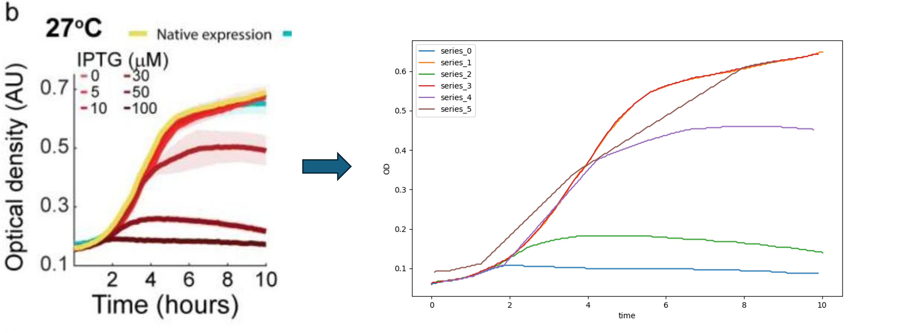
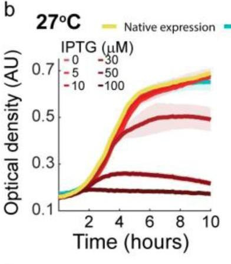

# Extract Line Chart Data


A repo that shows how to automatically extract the data of a line chart. Mainly a wrapper around [LineFormer](https://github.com/TheJaeLal/LineFormer) and [ChartDete](https://github.com/pengyu965/ChartDete/).

## Other Solutions
There's other solutions out there:
- [PP-Chart2Table](https://huggingface.co/PaddlePaddle/PP-Chart2Table) (Huggingface) - haven't tried and would love to hear opinions!
- [Graph2Table](https://graph2table.com/) - commercial SaaS, superior extraction that plextract but only 3 plots per day for free (as of 13.11.25)
- [Deplot](https://huggingface.co/google/deplot) - didn't work well for me on the example plots
- [Matcha ChartQA](https://huggingface.co/google/matcha-chartqa)
- Mostly the mentioned models as [a collection on Huggingface](https://huggingface.co/collections/tdsone/plot-image-2-data)

## Installation

⚠️ **No PyPI package exists yet.**  
Clone the repository and follow the steps below for either Modal or local execution.

### Modal (cloud, recommended)

```bash
git clone https://github.com/tdsone/extract-line-chart-data.git
cd extract-line-chart-data

# install the modal extra locally
uv pip install -e ".[modal]"
```

You need a [modal.com](https://modal.com/signup) account and the Modal CLI configured.

### Local execution (GPU required)

```bash
git clone https://github.com/tdsone/extract-line-chart-data.git
cd extract-line-chart-data

# create / activate a Python 3.10 virtualenv (example with uv)
uv venv --python 3.10
source .venv/bin/activate

# install project dependencies
uv pip install -e ".[local]"

# pull third-party models (mmcv-full + custom ChartDete fork)
bash setup_local_env.sh
```

`setup_local_env.sh` runs `mim install mmcv-full`, clones ChartDete into `third_party/ChartDete`, and installs its `mmdet` fork with `pip install --no-build-isolation -e`.

## Usage

All images in the folder `input` will be processed and results saved to `output`.

### Python API

```python
from plextract import extract

# Run locally (requires plextract[local])
extract(input_dir="input", output_dir="output", backend="local")

# Or run on Modal cloud (requires plextract[modal])
extract(input_dir="input", output_dir="output", backend="modal")
```

### Input/Output Folder Structure

**With Modal:**

```
<run_id>/
├── input
│   ├── input1.jpeg
│   ├── input2.jpeg
│   └── input3.png
└── output
    ├── input1.jpeg
    │   ├── axis_label_texts.json # Text extracted from axis labels
    │   ├── chartdete
    │   │   ├── bounding_boxes.json
    │   │   ├── cropped_xlabels_0.jpg # Cropped images of axis labels
    │   │   ├── ...
    │   │   ├── cropped_ylabels_0.jpg
    │   │   ├── ...
    │   │   ├── label_coordinates.json # Coordinates of the detected elements
    │   │   └── predictions.jpg # Image with bounding boxes of detected elements
    │   ├── converted_datapoints
    │   │   ├── data.json # The extracted data!
    │   │   └── plot.png # The plot generated from the extracted data
    │   └── lineformer
    │       ├── coordinates.json # The image relative coordinates of the lines
    │       └── prediction.png
    ├── input2.jpeg
    │   ├── ...
    └── input3.png
        ├── ...

14 directories, 60 files
```

## How It Works

The pipeline works as follows:

1. Use ChartDete to detect chart elements, most importantly axis labels and the plot area.
2. OCR the numbers from the labels.
3. Extract the coordinates of the lines in the line chart using LineFormer.
4. Correct the coordinates of the lines to be relative to the plot origin.
5. Calculate the conversion from pixels to axis values.
6. Convert the coordinates using the conversion parameter from step before.

## Example

### Input



### Output

This chart was generated using matplotlib using the extracted data (`examples/input2.png/data.json`)


## Resources

- [LineFormer](https://github.com/TheJaeLal/LineFormer)
- [ChartDete](https://github.com/pengyu965/ChartDete/)

# Contact

If you need help setting this up or would just like to use it, shoot me an email: mail@timonschneider.de